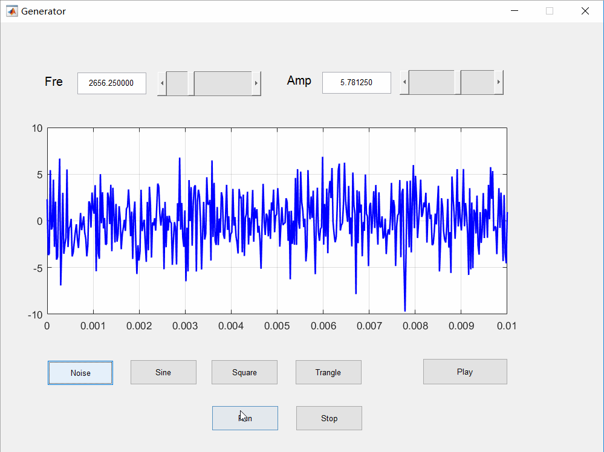

# signal-processing-project
This is signal processing exercise project.

## Environment
- Matlab2017

## Projects
- Electronic Piano

    Used the signal to simulate a real piano.
    

- Signal Generator

  A program to produce many diffierent signals.

## Contributing
- PengboHu
