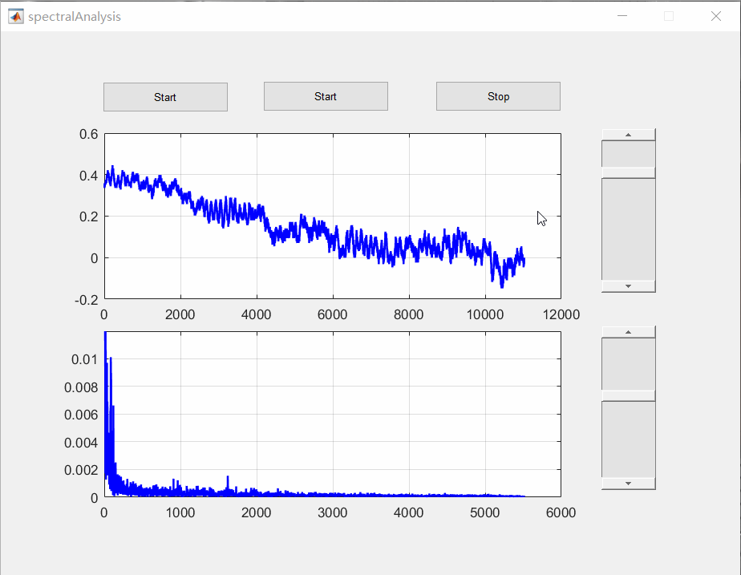

# Signal-processing-project
This is signal processing exercise project.

## Environment
- Matlab2017

## Projects
- Electronic Piano

    Using the signal to simulate a real piano.
    

- Signal generator

  A program to produce many diffierent signals.

- Spectral analysis

  Get the audio signal and using fourier transform to get the spectrum

## Contributing
- PengboHu
